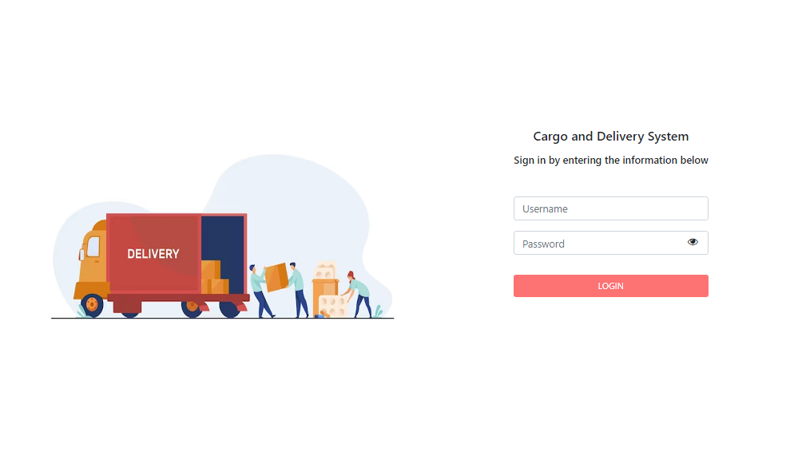
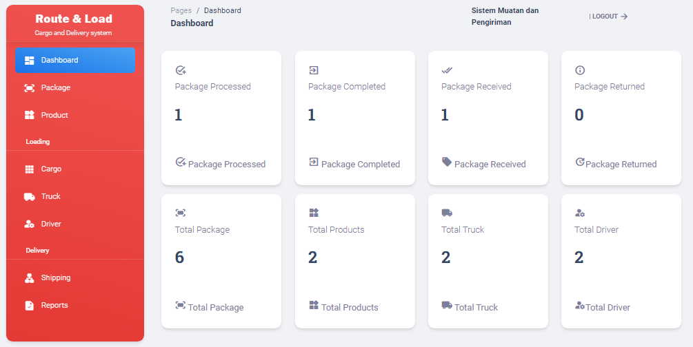
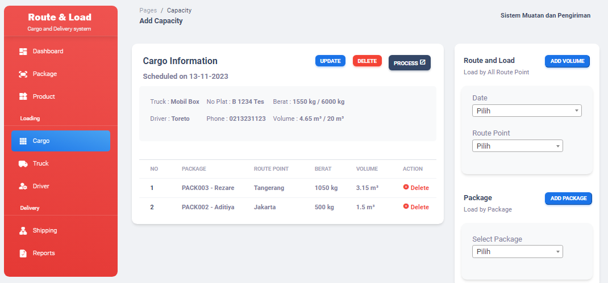
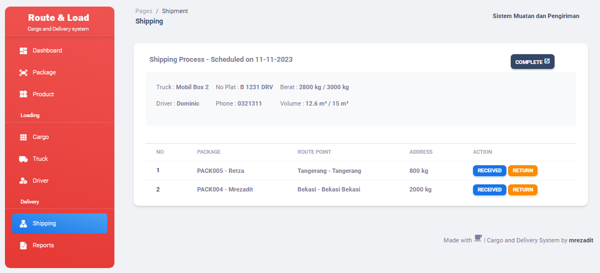

# About System
**Cargo and Delivery System (CodeIgniter) by mrezadit**
The case of this system is for **Capacity and Volume** of cargo and delivery process, system focuses on package volume, cargo process, route point and delivery process

# Features
- **Dashboard** - Summary of system progress & history
- **Package** - Set volume package, customer information, product order and volume of Package
- **Product** - Product data, set product volume
- **Cargo** - Process load capacity by adding route points and package volume, including truck data and driver data
- **Truck**- Set truck data, max capacity and max volume
- **Driver** -   Add driver information
- **Shipping** - Processing delivery from cargo data, and processing package delivery status by driver
- **Report** - Delivery Reports of shipping status

# Requirement
- **XAMPP**
- **PHP** (version 8.0.25, not tested with other version yet)

# How to install
- Copy and extract this folder to ``xampp/htdocs``
- Create database with the name ``db_pengiriman`` in phpmyadmin
- Import database file from ``/db/db_pengiriman.sql``
- Run this system in a browser, then input login information from ``READMEEE!!.txt``

# Screenshot
- **Login**
<picture>
    
</picture>

- **Dashboard**
<picture>
    
</picture>

- **Package Volume**
<picture>
    
</picture>

- **Cargo Process**
<picture>
    
</picture>

- **Shipping**
<picture>
    
</picture>

